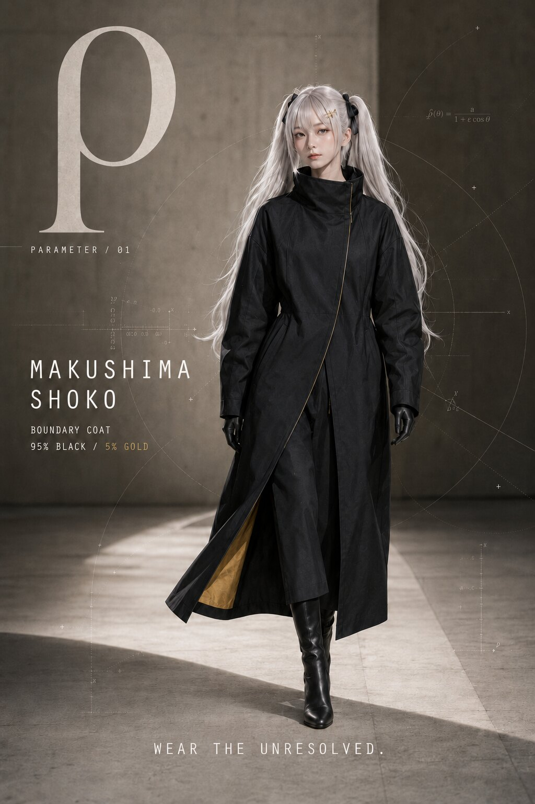
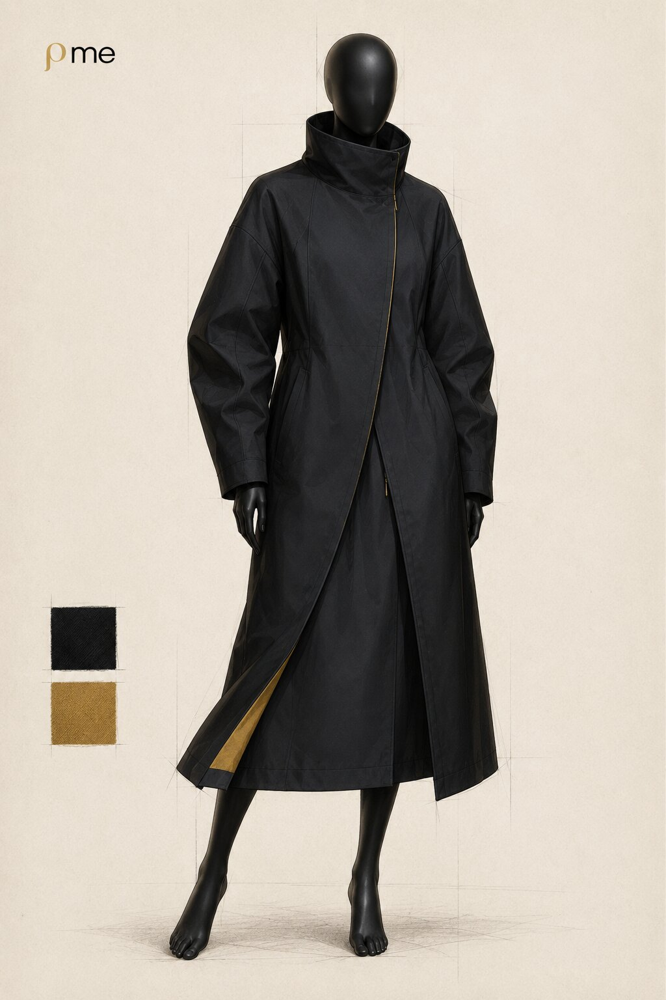

# 008：ρ me

> **Wear the Unresolved.**

服飾関係を全く知らない黒パグが、ブランドに必要なものをAIへ丸投げした結果、製作仕様書まで到達してしまった架空ファッションブランドです。

記号アイドルの冗談から生まれた `ρ me`（ローミー）は、研究、都市、身体、機械の境界を黒と鈍い金で扱います。  
最初のカプセルは **COLLECTION 01 — BOUNDARY COAT**。ミューズはオリジナルキャラクター **幕島翔子 / MAKUSHIMA SHOKO** です。

## COLLECTION 01 — BOUNDARY COAT

- Hero item: asymmetric technical coat
- Palette: black 95 / muted gold 5
- Motif: `ρ` as parameter, density, correlation and an unresolved variable
- Silhouette: long vertical line with controlled volume
- Status: concept and production-spec draft; no physical sample exists yet

## Design and construction

| Visual | Purpose |
|---|---|
| [Technical flat](assets/boundary-coat-flat.jpg) | Front/back silhouette and component placement |
| [Construction details](assets/boundary-coat-details.jpg) | Collar, closure, pocket and material intent |
| [Brand logo](assets/rho-me-logo.png) | Primary `ρ me` wordmark |

## Production document

[ρ me BOUNDARY COAT 制作仕様書 v1.0](spec/rho_me_BOUNDARY_COAT_spec_v1.0.docx)

20ページ構成の企画・製作用ドラフトです。デザイン意図、寸法、素材候補、縫製、付属、洗濯表示、検品、トワル確認まで含みます。実製作時にはパタンナー・縫製工場・素材メーカーによる再検証が必要です。

## Origin

このプロジェクトは「ブランドをAIに頼って作ったら、どこまで行くのか」という記事企画から始まりました。

1. 名前を作る
2. それっぽいブランド説明を作る
3. モード界隈を調べてメインアイテムを決める
4. デザイン画と平絵を作る
5. 以前作った実発注用衣装仕様書を思い出す
6. お任せした結果、20ページの資料ができる
7. 無駄なものフォルダではなくGitHubへ置く

閲覧数より先に、存在したというフットプリントを残します。

## Collaboration

これは実在ブランドの完成品ではなく、公開された企画提案です。アパレル、パターン、縫製、素材、撮影、編集など、現実へ落とせる方との共同検討は歓迎します。連絡はこのリポジトリのIssueからお願いします。

## Rights and notice

© 2026 黒パグ. All rights reserved.

本ディレクトリ内の名称、キャラクター、画像、文書は参照・ポートフォリオ閲覧用です。無断での商用利用、製造、再配布、学習データ化、キャラクター利用は許諾していません。画像と文書の制作には生成AIを使用しています。